# EXPERIENCE CONTINUOUS INTEGRATION WITH JENKINS ANSIBLE ARTIFACTORY SONARQUBE PHP

### Introduction

In this project, we would understand and get hands-on experience with the entire concept of CI/CD from an applications perspective. This would help us to gain real expertise around this idea, it is best to see it in action across different programming languages and from the platform perspective. In this project, we would focus on the application perspective focusing on the language PHP.

### What is Continuous Integration?
Continuous integration is a software development practice where developers regularly merge their code changes into a shared repository, such as a Git repository. This is done several times per day to avoid conflicts in the code and to ensure that the codebase remains stable and working. By running automated tests on the code after each merge, teams can catch and fix issues early, which helps to prevent "merge hell" and improve the overall quality of the code. Continuous integration helps teams to collaborate more effectively and deliver higher-quality software faster.

Note: The CI concept is not only about committing our code. There is a general workflow.

### CI Workflow
The CI workflow is as follows:
- **Run tests locally:** When you are working on a feature, you should run the tests locally to make sure that your code is working as expected. This is a good practice to follow even if you are not using CI. If you are using CI, you should run the tests locally before you commit your code to the repository. Developers write tests for their code called unit tests, and before they commit their work, they run their tests locally. This practice helps a team to avoid having one developer's work-in-progress code from breaking other developers’ copy of the codebase.

- **Compile code in CI:** After testing the code locally, you should commit your code to the repository. This is the second step in the CI workflow. The CI server picks up the code and runs the build there. In this project, we would use Jenkins as our CI server. The build happens either periodically or after every commit. The benefit of having a CI server is that it ensures that the code runs in a stable state and is visible to everyone. If the build fails, the CI server notifies the team members. This helps the team to fix the issue quickly.

- ** Run further tests in CI:** Even though tests have been run locally by developers, it is important to run the unit tests on the CI server as well. But, rather than focusing solely on unit tests, other kinds of tests and code analysis can be run using a CI server. These are extremely critical to determining the overall quality of code being developed, how it interacts with other developers’ work, and how vulnerable it is to attacks. A CI server can use different tools for Static Code Analysis, Code Coverage Analysis, Code smells Analysis, and Compliance Analysis. In addition, it can run other types of tests such as Integration and Penetration tests. Other tasks performed by a CI server include the production of code documentation from the source code and facilitating manual quality assurance (QA) testing processes.

Deploy an artifact from CI: Once the code has been tested and is ready to be deployed, the CI server can deploy the code to the production environment. This is the final step in the CI workflow. The CI server can deploy the code to the production environment automatically or manually. If the code is deployed automatically, the CI server can also perform a rollback if the deployment fails. This is a very important feature of a CI server. If the deployment fails, the CI server can roll back to the previous version of the code. This helps to avoid downtime and ensures that the production environment is always stable.

On the other hand, is Continuous Delivery which ensures that software checked into the mainline is always ready to be deployed to users. The deployment here is manually triggered after certain QA tasks are passed successfully. There is another CD known as Continuous Deployment which is also about deploying the software to the users, but rather than manual, it makes the entire process fully automated. Thus, Continuous Deployment is just one step ahead in automation than Continuous Delivery.

### Continuous Integration in the Real World
To emphasize a typical CI pipeline further, let us explore the diagram below:


**Version Control:** This is the stage where developers commit their code to the version control system after they have tested their code locally.

**Build:** Depending on the type of language or technology used, we might need to build the code into binary executables for compiled languages or just package the code together with all necessary dependencies for interpreted languages.

**Unit Test:** Unit tests that have been developed by the developers are run on the code. This is done to ensure that the code is working as expected. Depending on how the CI job is configured, the entire pipeline may fail if part of the tests fails, and developers will have to fix this failure before starting the pipeline again. A job is a phase in the pipeline and since Unit Test is a phase in the pipeline, it is called a job.

**Deploy:** Once the tests are passed, the next phase is to deploy the compiled or packaged code into an artifact repository. This is where all the various versions of code are stored. This is also where the CI tool will have to pick up the code from this location to proceed with the remaining parts of the pipeline.

**Auto Test:** Apart from Unit testing, there are many other kinds of tests that are required to analyze the quality of code and determine how vulnerable the software will be to external or internal attacks. These tests must be automated, and there can be multiple environments created to fulfill different test requirements. For example, a server dedicated to Integration Testing will have the code deployed there to conduct integration tests. Once that passes, there can be other sub-layers in the testing phase to which the code will be deployed, to conduct further tests. Such is User Acceptance Testing (UAT), and another can be Penetration Testing. These servers will be named according to what they have been designed to do in those environments. A UAT server is generally used for UAT, SIT server is for Systems Integration Testing, PEN Server is for Penetration Testing and they can be named whatever the naming style or convention in which the team is used. An environment does not necessarily have to reside on one single server. In most cases, it might be a stack as you have defined in your Ansible Inventory. All the servers in the inventory/dev are considered as Dev Environment. The same goes for inventory/stage (Staging Environment) inventory/preprod (Pre-production environment), inventory/prod (Production environment), etc. So, it is all down to naming convention as agreed and used company or team-wide.

Deploy to production: Once all the tests have been passed, and the release manager has approved the release, the code is deployed to the production environment. This is an ideal Continuous Delivery Pipeline. If the entire process is automated, it is called a Continuous Deployment Pipeline. This is because the cycle will be repeated, and every time there is a code commit and push, it causes the pipeline to trigger, and the loop continues over and over again.

Measure and Validate: This are where real users are interacting with the application and feedback is collected for further improvements and bug fixes.

Common Best Practices of CI/CD
There are principles that define a reliable and robust CI/CD pipeline. These principles are:

- Maintain a code repository.
- Automate the build process.
- Make the build self-testing.
- Everyone commits to the baseline every day.
- Every commit (to baseline) should be built.
- Keep the build fast.
- Test in a clone of the production environment.
- Make it easy to get the latest deliverables.
- Everyone can see what’s happening and the results of the latest build.
- Automate deployment. This should be done if you're confident enough in your CI/CD pipeline and willing to go for a fully automated continuous deployment.

**Devops Success Metrics**
Many metrics must be determined and observed here. We will quickly go through 13 metrics that must be determined and observed in a CI/CD pipeline.

After all, DevOps is all about continuous delivery or deployment, and being able to ship out quality code as fast as possible. This is a very ambitious thing to desire; therefore, we must be careful not to break things as we are moving very fast. By tracking these metrics, we can determine our delivery speed and bottlenecks before breaking things. Ultimately, the goals of DevOps are enhanced Velocity, Quality, and Performance. But how do we track these parameters? Let us have a look at the 13 metrics to watch out for.

1 Deployment frequency: Tracking how often you do deployments is a good DevOps metric. Ultimately, the goal is to do more smaller deployments as often as possible. Reducing the size of deployments makes it easier to test and release. I would suggest counting both production and non-production deployments separately. How often you deploy to QA or pre-production environments is also important. You need to deploy early and often in QA to ensure enough time for testing.

2 Lead time: If the goal is to ship code quickly, this is a key DevOps metric. I would define lead time as the amount of time that occurs between starting on a work item until it is deployed. This helps you know that if you started on a new work item today, how long would it take on average until it gets to production.

3 Customer tickets: The best and worst indicator of application problems is customer support tickets and feedback. The last thing you want is your users reporting bugs or having problems with your software. Because of this, customer tickets also serve as a good indicator of application quality and performance problems.

4 Percentage of passed automated tests: To increase velocity, it is highly recommended that the development team makes extensive usage of unit and functional testing. Since DevOps relies heavily on automation, tracking how well automated tests work is a good DevOps metrics. It is good to know how often code changes break tests.

5 Defect escape rate: Do you know how many software defects are being found in production versus QA? If you want to ship code fast, you need to have confidence that you can find software defects before they get to production. Defect escape rate is a great DevOps metric to track how often those defects make it to production.

6 Availability: The last thing we ever want is for our application to be down. Depending on the type of application and how we deploy it, we may have a little downtime as part of scheduled maintenance. It is highly recommended to track this metric and all unplanned outages. Most software companies build status pages to track this. Such as this Google Products Status Page

7 Service level agreements: Most companies have some service level agreement (SLA) that they promise to the customers. It is also important to track compliance with SLAs. Even if there are no formally stated SLAs, there probably are application non-functional requirements or expectations to be met.

8 Failed deployments: We all hope this never happens, but how often do our deployments cause an outage or major issues for the users? Reversing a failed deployment is something we never want to do, but it is something you should always plan for. If you have issues with failed deployments, be sure to track this metric over time. This could also be seen as tracking *Mean Time To Failure (MTTF).

9 Error rates: Tracking error rates within the application is super important. Not only they serve as an indicator of quality problems, but also ongoing performance and uptime related issues. In software development, errors are also known as exceptions, and proper exception handling is critical. If they are not handled nicely, we can figure it out while monitoring the rate of errors.

Bugs – Identify new exceptions being thrown in the code after a deployment Production issues – Capture issues with database connections, query timeouts, and other related issues

Presenting error rate metrics like this simply gives greater insights into where to focus attention.

10 Application usage & traffic: After a deployment, we want to see if the number of transactions or users accessing our system looks normal. If we suddenly have no traffic or a giant spike in traffic, something could be wrong. An attacker may be routing traffic elsewhere, or initiating a DDOS attack

11 Application performance: Before we even perform a deployment, we should configure monitoring tools like Retrace, DataDog, New Relic, or AppDynamics to look for performance problems, hidden errors, and other issues. During and after the deployment, we should also look for any changes in overall application performance and establish some benchmarks to know when things deviate from the norm.

It might be common after a deployment to see major changes in the usage of specific SQL queries, web service or HTTP calls, and other application dependencies. These monitoring tools can provide valuable visualizations like this one below that helps make it easy to spot problems.

12 Mean time to detection (MTTD): When problems happen, it is important that we identify them quickly. The last thing we want is to have a major partial or complete system outage and not know about it. Having robust application monitoring and good observability tools in place will help us detect issues quickly. Once they are detected, we also must fix them quickly!

13 Mean time to recovery (MTTR): This metric helps us track how long it takes to recover from failures. A key metric for the business is keeping failures to a minimum and being able to recover from them quickly. It is typically measured in hours and may refer to business hours, not calendar hours.

These are the major metrics that any DevOps team should track and monitor to understand how well CI/CD process is established and how it helps to deliver quality application to the users.

## Prerequisites

### Simulating a typical CI/CD Pipeline for a PHP based application

As part of an ongoing infrastructure development with Ansible from our previous projects. Here we will be creating a pipeline that simulates continuous integration and delivery. The target end-to-end CI/CD pipeline is shown below:


Note: It is important to know that both Tooling and TODO web applications are based on an interpreted (scripting) language which is PHP. This means that it can be deployed directly onto a server and will work without compiling the code to a machine language.

The challenge behind this approach is, it would be difficult to package and version the software for different releases. And so, in this project, we will be using a different approach for releases, rather than downloading directly from git, we will be using Ansible's 'uri module' to download the latest release from GitHub.

### Setting up the Environment

This project is partly a continuation of your Ansible work, so simply add and subtract based on the new setup in this project. It will require a lot of servers to simulate all the different environments from dev/ci all the way to production. This will be quite a lot of servers altogether (But you don’t have to create them all at once. Only create servers required for an environment you are working with at the moment. For example, when doing deployments for development, do not create servers for integration, pentest, or production yet).

To get started we would focus on the following environments:

- CI
- Development (Dev)
- Pentest

Both SIT – For System Integration Testing and UAT – User Acceptance Testing do not require a lot of extra installation or configuration. They are basically the webservers holding our applications. But Pentest – For Penetration testing is where we will conduct security related tests, so some other tools and specific configurations will be needed. In some cases, it will also be used for Performance and Load testing. Otherwise, that can also be a separate environment on its own. It all depends on decisions made by the company and the team running the show.

What we want to achieve, is having Nginx to serve as a reverse proxy for our sites and tools. Each environment setup is represented in the below table and diagrams.

**CI Environmrnt**


**Other Environments from Lower to Higher**


**DNS Requirements**
- Make DNS entries to create a subdomain for each environment. Assuming our main domain is "test.io"

We should have a subdomains list like this:

| Server      | Domain |
| ----------- | ----------- |
| Jenkins      | https://ci.infradev.test.io       |
| Sonarqube   | https://sonar.infradev.test.io        |
| Artifactory | https://artifactory.infradev.test.io |
| Production tooling	      | https://tooling.test.io |
| Pre-production tooling | https://tooling.preprod.test.io|
| Pentest tooling	      | https://tooling.pentest.test.io       |
| UAT tooling	   | https://tooling.uat.test.io        |
| SIT tooling	      | https://tooling.sit.test.io |
|  Development tooling	| https://tooling.dev.test.io |
| Production TODO-webapp	      | https://todo.test.io       |
| Pre-production TODO-webapp	   | https://todo.preprod.test.io        |
| Pentest TODO-webapp   | https://todo.pentest.test.io |
|  UAT TODO-webapp	| https://todo.uat.test.io |
| SIT TODO-webapp	      | https://todo.sit.test.io       |
| Development TODO-webapp	   | https://todo.dev.test.io        |

### Ansible Inventory

Our Ansible inventory folder should look like this:

```
├── ci
├── dev
├── pentest
├── pre-prod
├── prod
├── sit
└── uat
```
**Inventory files**

Our ansible inventory files for each environment should look like this:

**CI Environment Inventory File**

Create an inventory file for the CI environment. This will be used to access Jenkins, Nginx, Artifact Repository and Sonarqube. The inventory file should look like this:

```
[jenkins]
<Jenkins-Private-IP-Address>

[nginx]
<Nginx-Private-IP-Address>

[sonarqube]
<SonarQube-Private-IP-Address>

[artifact_repository]
<Artifact_repository-Private-IP-Address>
```
**Development Environment Inventory File**

Create an inventory file for the Development environment. This will be used to access Nginx, TODO-webapp and Tooling. The inventory file should look like this:

```
[tooling]
<Tooling-Web-Server-Private-IP-Address>

[todo]
<Todo-Web-Server-Private-IP-Address>

[nginx]
<Nginx-Private-IP-Address>

[db:vars]
ansible_user=ec2-user
ansible_python_interpreter=/usr/bin/python

[db]
<DB-Server-Private-IP-Address>
```
**Pentest Environment Inventory File**

Create an inventory file for the Pentest environment. This will be used to access Nginx, TODO-webapp and Tooling. The inventory file should look like this:

```
[pentest:children]
pentest-todo
pentest-tooling

[pentest-todo]
<Pentest-for-Todo-Private-IP-Address>

[pentest-tooling]
<Pentest-for-Tooling-Private-IP-Address>
```
**Note**

You will notice that in the pentest inventory file, we have introduced a new concept pentest:children This is because, we want to have a group called pentest which covers Ansible execution against both pentest-todo and pentest-tooling simultaneously. But at the same time, we want the flexibility to run specific Ansible tasks against an individual group. The db group has a slightly different configuration. It uses a RedHat/Centos Linux distro. Others are based on Ubuntu (in this case user is ubuntu). Therefore, the user required for connectivity and path to python interpreter are different. If all your environment is based on Ubuntu, you may not need this kind of set up. Totally up to you how you want to do this. Whatever works for you is absolutely fine in this scenario. This makes us to introduce another Ansible concept called group_vars. With group vars, we can declare and set variables for each group of servers created in the inventory file.

For example, If there are variables we need to be common between both pentest-todo and pentest-tooling, rather than setting these variables in many places, we can simply use the group_vars for pentest. Since in the inventory file it has been created as pentest:children Ansible recognizes this and simply applies that variable to both children.

**Ansible Roles for CI Environment**

Now go ahead and Add two more roles to ansible:

    1. SonarQube
    2. Artifactory

**Why do we need SonarQube?**

SonarQube is an open-source platform developed by SonarSource for continuous inspection of code quality, it is used to perform automatic reviews with static analysis of code to detect bugs, code smells, and security vulnerabilities. Watch a short description here. There is a lot more hands on work ahead with SonarQube and Jenkins. So, the purpose of SonarQube will be clearer to you very soon.

**Why do we need Artifactory?**

Artifactory is a product by JFrog that serves as a binary repository manager. The binary repository is a natural extension to the source code repository, in that the outcome of your build process is stored. It can be used for certain other automation, but we will it strictly to manage our build artifacts.

**Dependences to be installed**

Install php on todo server
=====================================

- yum module reset php -y
- yum module enable php:remi-7.4 -y
- yum install -y php php-common php-mbstring php-opcache php-intl php-xml php-gd - php-curl php-mysqlnd php-fpm php-json
- systemctl start php-fpm
- systemctl enable php-fpm

**Ansible dependencies to install**
=====================================

- For Mysql Database
- ansible-galaxy collection install community.mysql
- For Postgresql Database
- ansible-galaxy collection install community.postgresql

**Install composer**
=====================================

- curl -sS https://getcomposer.org/installer | php
- sudo mv composer.phar /usr/bin/composer

 **Verify Composer is installed or not**

``` 
composer --version

```

**Install phpunit, phploc**
=====================================

- sudo dnf --enablerepo=remi install php-phpunit-phploc
- wget -O phpunit https://phar.phpunit.de/phpunit-7.phar
- chmod +x phpunit
- sudo yum install php-xdebug

**for database connection**

==================================== 

DB_CONNECTION=mysql DB_PORT=3306

sudo vi /etc/mysql/mysql.conf.d/mysqld.cnf sudo yum install mysql -y

Learn how to install Jenkins [here](https://www.jenkins.io/doc/book/installing/)

Learn how to installk artifactory [here](https://jfrog.com/open-source/)


**Configuring Ansible for Jenkins Deployment**

Here you would see a step by step process on how to configure Jenkins and ansible for deployment.

**Requirements:**

- EC2 instance with RedHat Linux distro

- Jenkins installed

- Ansible installed

- Code Repository [Github](https://github.com/manny-uncharted/ansible-config-mgt.git)

- Spin up your EC2 instance with RedHat Linux distro and ensure you install git

```
sudo yum install git
```
and then clone the repository from Github

```
git clone [repo-link](https://github.com/Goddhi/ansible-config-mgt)

```

- Install Jenkins

```
sudo wget -O /etc/yum.repos.d/jenkins.repo \
    https://pkg.jenkins.io/redhat-stable/jenkins.repo
sudo rpm --import https://pkg.jenkins.io/redhat-stable/jenkins.io.key
sudo yum upgrade
# Add required dependencies for the jenkins package
sudo yum install java-11-openjdk
sudo yum install jenkins
sudo systemctl daemon-reload
```
- To start Jenkins, run the following command:

```
sudo systemctl start jenkins
sudo systemctl enable jenkins
sudo systemctl status jenkins
```
- To access Jenkins, open a web browser and enter the public IP address of your EC2 instance, followed by :8080. Note: If you are using a security group, make sure you have port 8080 open.

- To get the initial password, run the following command:

 ```
 sudo cat /var/lib/jenkins/secrets/initialAdminPassword
 ```
 paste the initial password in the browser and click continue

- Install the suggested plugins and create your first admin user

- Once your are done with the initial setup, you will be redirected to the Jenkins dashboard. Click on Manage Jenkins and then click on Manage Plugins. Click on the available tab and search for blue ocean. Install the blue ocean plugin and install without restart.

Result:
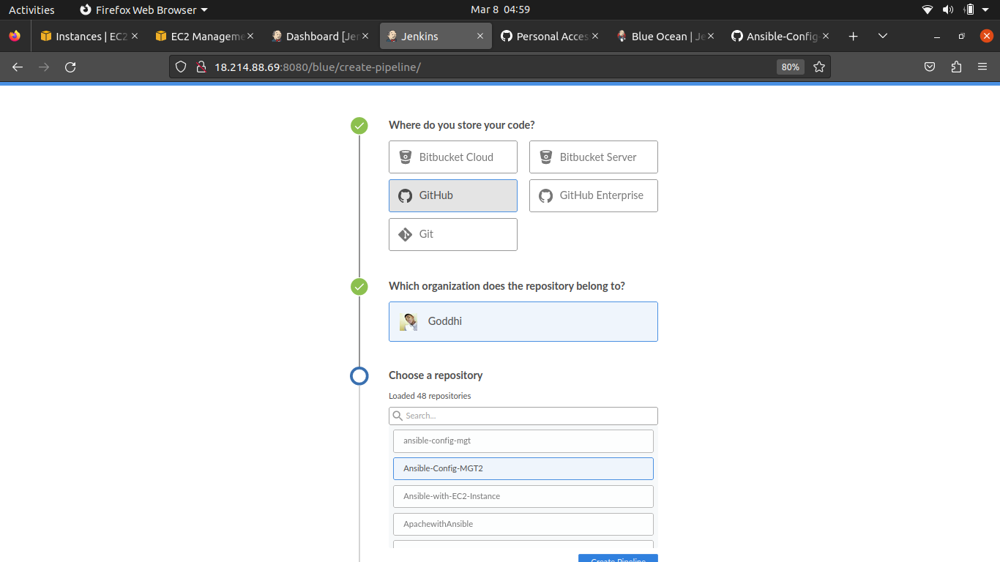

- Now go to dashboard and click on "Open Blue Ocean" and then click on "Create a new pipeline"


- Select Github and click on "Github" and enter your github access token and click on "Connect" and then select the repository you want to use for your project and click on "Create Pipeline"

- Inside the code repository in your EC2 instance, create a folder and name it 'deploy' and inside deploy create a jenkinsfile and paste the code below

```
pipeline {
    agent any

    stages {
        stage('Build') {
            steps {
                script {
                    sh 'echo "Building stage"'
                }
            }
        }
    }
}
```
- Now push the code to your github repository and go back to your jenkins dashboard and click on "ansible config mgt" and then click on configure.

Here we are trying to tell jenkins the path to our build configuration file which is in the 'deploy/' folder. So we will add the path to the jenkinsfile in the "Build Configuaration" section and click on "Save"

- Once you have saved the configuration, the build would automatically start and you can open blue ocean to see the build process.

Note: You notice that this pipeline is a multibranch one. This means, if there were more than one branch in Github. Jenkins would scan all branches and trigger a build for each branch.

- To see the multibranch pipeline in effect,

  - create a new branch and name it 'feature/jenkinspipeline-stages'

```
git checkout -b feature/jenkinspipeline-stages
```
  - At the moment we only have the build stage in our jenkinsfile. So we will add the other stages to our jenkinsfile and push the code to github.

```
 stage('Test') {
  steps {
    script {
      sh 'echo "Testing Stage"'
    }
  }
}
```

- To make your new branch show up in Jenkins, we need to tell Jenkins to scan the repository. Click on the "Administration button" and navigate to the "Ansible Config Mgt" project and click on "Scan repository now". Refresh the page and both branches will start building automatically. You can go into Blue Ocean to see both branches there too.

- In Blue Ocean, you can now see how the Jenkinsfile has caused a new step in the pipeline launch build for the new branch.

- Let's create a pull request to merge the latest code into the main branch. After merging the pull request, go back into the main branch and pull the latest change.

- Create a new branch, add more stages into the Jenkins file to simulate below phases. (Just add an echo command like we have in build and test stages)
  i. Package
  ii. Deploy
  iii. Clean up

```
pipeline {
    agent any

    stages {
        stage('Initial Cleanup') {
            steps {
                dir("${WORKSPACE}") {
                    deleteDir()
                }
            }
        }

        stage('Build') {
            steps {
                script {
                    sh 'echo "Building stage"'
                }
            }
        }

        stage('Test') {
            steps {
                script {
                    sh 'echo "Testing Stage" '
                }
            }
        }

        stage('Package') {
            steps {
                script {
                    sh 'echo "Packaging Stage"'
                }
            }
        }

        stage('Deploy') {
            steps {
                script {
                    sh 'echo "Deployment Stage"'
                }
            }
        }

        stage('Final Clean Up') {
            steps {
                cleanWs()
                
            }
        }
    }
}

```
- Verify in Blue Ocean that all the stages are working, then merge your feature branch to the main branch

Result:

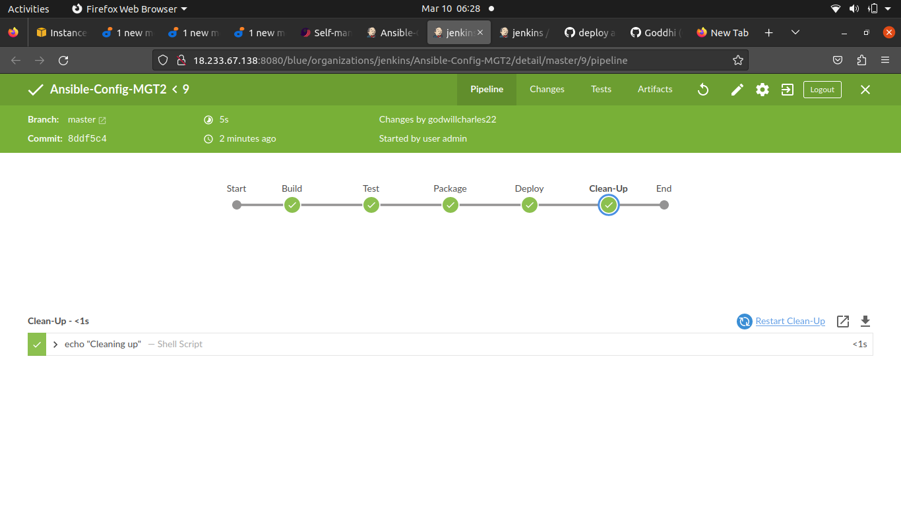

Eventually, your main branch should have a successful pipeline like this in blue ocean

### Running Ansible Playbook from Jenkins

- Install Ansible in your EC2 instance

```
sudo yum install ansible
```
- Install the Ansible plugin in Jenkins
- Go to Jenkins dashboard and click on "Manage Jenkins" and then click on "Manage Plugins"
- Click on the available tab and search for ansible. Install the ansible plugin and install without restart.

- Creating Jenkinsfile from scratch. (Delete all you currently have in there and start all over to get Ansible to run successfully)

Note: Jenkins needs to export the ANSIBLE_CONFIG environment variable. You can put the .ansible.cfg file alongside Jenkinsfile in the deploy directory. This way, anyone can easily identify that everything in there relates to deployment. Then, using the Pipeline Syntax tool in Ansible, generate the syntax to create environment variables to set.

### Parameterizing Jenkinsfile for Ansible Deployment. 
To deploy to other environments, we will need to use parameters. But for the purpose of this we would just run our playbook against the development environment.

  - Create two new instances
     - Nginx - Redhat 8
     - DB - ubuntu

- Delete the details in the existing jenkinsfile and update it to run against the dev environment also create a file called ansible.cfg as this would contain our ansible configuration settings


for the ansible.cfg file, add the following code

```
[defaults]
timeout = 160
callback_whitelist = profile_tasks
log_path=~/ansible.log
host_key_checking = False
gathering = smart
ansible_python_interpreter=/usr/bin/python3
allow_world_readable_tmpfiles=true


[ssh_connection]
ssh_args = -o ControlMaster=auto -o ControlPersist=30m -o ControlPath=/tmp/ansible-ssh-%h-%p-%r -o ServerAliveInterval=60 -o ServerAliveCountMax=60 -o ForwardAgent=yes
```
```
pipeline {
    agent any

    environment {
        ANSIBLE_CONFIG="${WORKSPACE}/deploy/ansible.cfg"
    }

    parameters {
      string(name: 'inventory', defaultValue: 'dev',  description: 'This is the inventory file for the environment to deploy configuration')
    }

    stages{
        stage("Initial cleanup") {
            steps {
                dir("${WORKSPACE}") {
                deleteDir()
                }
            }
        }

        stage('Checkout SCM') {
            steps{
                git branch: 'main', url: 'https://github.com/Goddhi/Ansible-Config-MGT2'
            }
        }

        stage('Prepare Ansible For Execution') {
            steps {
                sh 'echo ${WORKSPACE}' 
                sh 'sed -i "3 a roles_path=${WORKSPACE}/roles" ${WORKSPACE}/deploy/ansible.cfg'  
            }
        }

        stage('Run Ansible playbook') {
            steps {
                ansiblePlaybook colorized: true, credentialsId: 'private-key', disableHostKeyChecking: true, installation: 'ansible', inventory: 'inventory/dev.yml', playbook: 'playbooks/site.yml'
            }
        }

        stage('Clean Workspace after build'){
            steps{
                cleanWs(cleanWhenAborted: true, cleanWhenFailure: true, cleanWhenNotBuilt: true, cleanWhenUnstable: true, deleteDirs: true)
            }
        }
    }
}

```
- Note: To generate the ansible playbook syntax, click on "Pipeline Syntax" and then click on "Snippet Generator" and then select "Ansible Playbook" and then click on "Generate Pipeline Script" and then copy the code and paste it into your Jenkinsfile.


- Navigate to "Manage Jenkins" and click on "Manage Credentials" and click on global and click on "Add Credentials" and add your private key. (This is the private key you used to create your instances)

Result:

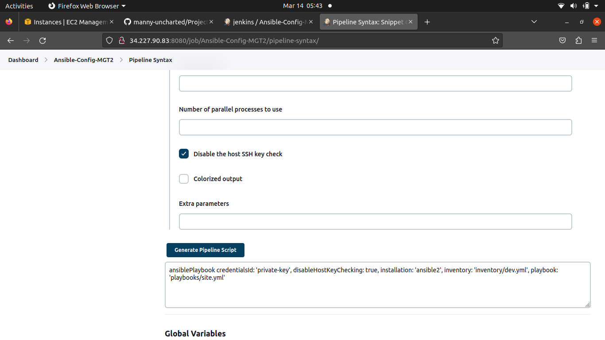
- Navigate back to the "Dashboard" and click on "Manage Jenkins" and then on "Global Tool Configuration" and then scroll down to "Ansible" and click on "Add Ansible" and add the path to the ansible executable. (This is the path to the ansible executable on your EC2 instance) in this case the file path is /usr/bin and then click on "Apply" and then "Save"

Result:

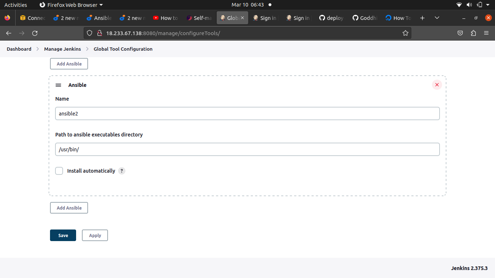
 
 Now you can commit your changes and push to the main branch and then run the pipeline.


### CI/CD Pipeline for Todo Application

Here we will introduce another PHP application to add to the list of software products we are managing in our infrastructure. The good thing with this particular application is that it has unit tests, and it is an ideal application to show an end-to-end CI/CD pipeline for a particular application.

The goal here is to deploy the application onto servers directly from Artifactory rather than from git. If you have not updated Ansible with an Artifactory role, simply use this guide to create an Ansible role for Artifactory (ignore the Nginx part).

#### Prepare Jenkins
- Fork the repository from [here](https://github.com/Goddhi/php-todo) to your github account.

- On your Jenkins server, install PHP, its dependencies and Composer tool. You can use the following commands to install PHP and its dependencies

```
sudo apt install -y zip libapache2-mod-php phploc php-{xml,bcmath,bz2,intl,gd,mbstring,mysql,zip}
```
#### Integrate Artifactory with Jenkins

- Install Jenkins Plugins

    - Plot plugin
    - Artifactory plugin

We will use plot plugin to display tests reports, and code coverage information.

The Artifactory plugin will be used to easily upload code artifacts into an Artifactory server.

#### Install composer

```
curl -sS https://getcomposer.org/installer | php
sudo mv composer.phar /usr/bin/composer

```
  - Launch a new Instance for Artifactory

- Redhat 9
- t2.medium
- 4GB RAM
- 10GB minimum Storage

We would be using ansible roles to install artifactory on the instance we just created. The roles are located in the ansible-config-mgt repository. So we need to update the 'ci' inventory with the artifactory private address and then commit and push the changes to the main branch.

  - Then we run the ansible playbook to run against the 'ci' inventory and install artifactory on the instance we just created.

Result:


- Ensure you have port '8082' open in the security group of the artifactory instance.

- Now open jfrog artifactory on your browser and login with the default credentials (admin:password)

- Create a new local repository called 'PBL' and select the type as 'Generic' and then click on 'Create'

Result:

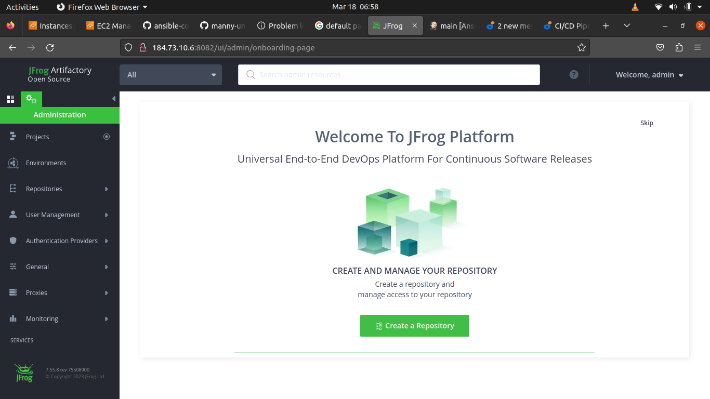

- To configure our artifactory server in Jenkins, we need to do the following:
- Go to "Manage Jenkins" and then click on "Configure System"
- Scroll down to "Artifactory" and click on "Add Artifactory  Server" and add the following details
- Name: artifactory
- URL: http://artifactory:8081/artifactory
- Credentials: Add credentials and add your artifactory username and password
- Ensure you test connection and it is successful
- Click on "Apply" and then "Save"

Results:

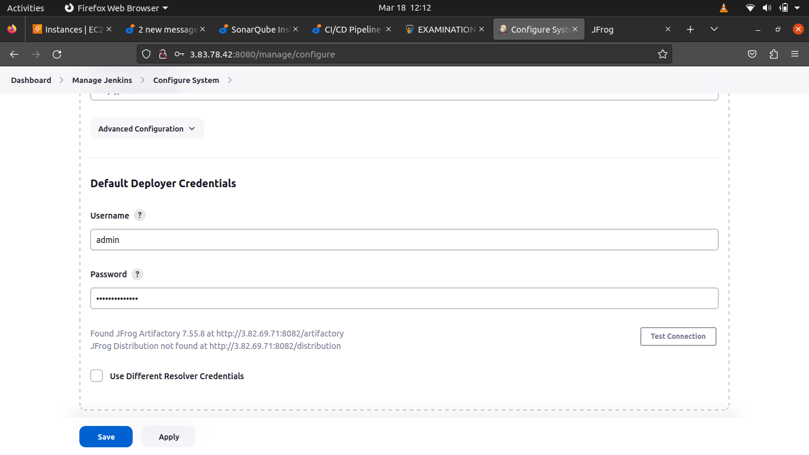

- Now we need to create a jenkinsfile inside the php-todo repository. The jenkinsfile will contain the following code:

```
pipeline {
    agent any

    stages {

    stage("Initial cleanup") {
        steps {
        dir("${WORKSPACE}") {
            deleteDir()
        }
        }
    }

    stage('Checkout SCM') {
        steps {
            git branch: 'main', url: 'https://github.com/manny-uncharted/php-todo.git'
        }
    }

    stage('Prepare Dependencies') {
      steps {
             sh 'mv .env.sample .env'
             sh 'composer install'
             sh 'php artisan migrate'
             sh 'php artisan db:seed'
             sh 'php artisan key:generate'
      }
    }
  }
}
```

- Before we execute the pipeline, we need to create a database and a user

```
Create database homestead;
CREATE USER 'homestead'@'%' IDENTIFIED BY 'sePret^i';
GRANT ALL PRIVILEGES ON * . * TO 'homestead'@'%';
```
But instead of logging into the database server, we can use the mysql ansible role to create the database and user. So we need to update the 'ci' inventory with the database server private address and then commit and push the changes to the main branch.

```
mysql_databases:
  - name: homestead
    collation: utf8_general_ci
    encoding: utf8
    replicate: 1

mysql_users:
  - name: homestead
    host: <private-ip-address-of-your-jenkins-server>
    password: sePret^i
    priv: '*.*:ALL,GRANT'

```


- Then we run the ansible playbook to run against the 'dev.yml' inventory and create the database and user.


- Now let's commit the Jenkinsfile created in our php-todo repository and push to the main branch. Then we can create a new pipeline and select the php-todo repository and then configure it to find the jenkinsfile and build the pipeline.

Note: When running the initial build process you might run into an error like this:

[php-loc-error](php-loc-error.png)

To fix this:

- Install mysql-client on your jenkins server

```
sudo apt install mysql-client
```
- ssh into the mysql server and edit the configuration file

```
sudo nano /etc/mysql/mysql.conf.d/mysqld.cnf
```
edit the bind address to

```
bind-address = 0.0.0.0
```

and then restart the mysql service

```
sudo systemctl restart mysql
sudo systemctl status mysql
```
- In the php-todo repository, edit the .env file and change the following details

```
DB_HOST=172.31.31.234
DB_CONNECTION=mysql
DB_PORT=3306
```
and then commit and push the changes to the main branch.

- Update the Jenkinsfile to include Unit tests step

```
stage('Execute Unit Tests') {
    steps {
        sh './vendor/bin/phpunit'
    }
}
```
### Code Quality Analysis

This is one of the areas where developers, architects and many stakeholders are mostly interested in as far as product development is concerned. As a DevOps engineer, you also have a role to play. Especially when it comes to setting up the tools.

For PHP the most commonly tool used for code quality analysis is phploc. [Read more here](https://matthiasnoback.nl/2019/09/using-phploc-for-quick-code-quality-estimation-part-1/)

The data produced by phploc can be ploted onto graphs in Jenkins.

- Add the code analysis step in jenkinsfile. The output of the data will be saved in 'build/logs/phploc.csv' file.

```
stage('Code Analysis') {
    steps {
        sh 'phploc app/ --log-csv build/logs/phploc.csv'
    }
}
```
- Plot the data using plot Jenkins plugin. This plugin provides generic plotting (or graphing) capabilities in Jenkins. It will plot one or more single values variations across builds in one or more plots. Plots for a particular job (or project) are configured in the job configuration screen, where each field has additional help information. Each plot can have one or more lines (called data series). After each build completes the plots’ data series latest values are pulled from the CSV file generated by phploc.

```
stage('Plot Code Coverage Report') {
    steps {
        plot csvFileName: 'plot-396c4a6b-b573-41e5-85d8-73613b2ffffb.csv', csvSeries: [[displayTableFlag: false, exclusionValues: 'Lines of Code (LOC),Comment Lines of Code (CLOC),Non-Comment Lines of Code (NCLOC),Logical Lines of Code (LLOC)                          ', file: 'build/logs/phploc.csv', inclusionFlag: 'INCLUDE_BY_STRING', url: '']], group: 'phploc', numBuilds: '100', style: 'line', title: 'A - Lines of code', yaxis: 'Lines of Code'
        plot csvFileName: 'plot-396c4a6b-b573-41e5-85d8-73613b2ffffb.csv', csvSeries: [[displayTableFlag: false, exclusionValues: 'Directories,Files,Namespaces', file: 'build/logs/phploc.csv', inclusionFlag: 'INCLUDE_BY_STRING', url: '']], group: 'phploc', numBuilds: '100', style: 'line', title: 'B - Structures Containers', yaxis: 'Count'
        plot csvFileName: 'plot-396c4a6b-b573-41e5-85d8-73613b2ffffb.csv', csvSeries: [[displayTableFlag: false, exclusionValues: 'Average Class Length (LLOC),Average Method Length (LLOC),Average Function Length (LLOC)', file: 'build/logs/phploc.csv', inclusionFlag: 'INCLUDE_BY_STRING', url: '']], group: 'phploc', numBuilds: '100', style: 'line', title: 'C - Average Length', yaxis: 'Average Lines of Code'
        plot csvFileName: 'plot-396c4a6b-b573-41e5-85d8-73613b2ffffb.csv', csvSeries: [[displayTableFlag: false, exclusionValues: 'Cyclomatic Complexity / Lines of Code,Cyclomatic Complexity / Number of Methods ', file: 'build/logs/phploc.csv', inclusionFlag: 'INCLUDE_BY_STRING', url: '']], group: 'phploc', numBuilds: '100', style: 'line', title: 'D - Relative Cyclomatic Complexity', yaxis: 'Cyclomatic Complexity by Structure'      
        plot csvFileName: 'plot-396c4a6b-b573-41e5-85d8-73613b2ffffb.csv', csvSeries: [[displayTableFlag: false, exclusionValues: 'Classes,Abstract Classes,Concrete Classes', file: 'build/logs/phploc.csv', inclusionFlag: 'INCLUDE_BY_STRING', url: '']], group: 'phploc', numBuilds: '100', style: 'line', title: 'E - Types of Classes', yaxis: 'Count'
        plot csvFileName: 'plot-396c4a6b-b573-41e5-85d8-73613b2ffffb.csv', csvSeries: [[displayTableFlag: false, exclusionValues: 'Methods,Non-Static Methods,Static Methods,Public Methods,Non-Public Methods', file: 'build/logs/phploc.csv', inclusionFlag: 'INCLUDE_BY_STRING', url: '']], group: 'phploc', numBuilds: '100', style: 'line', title: 'F - Types of Methods', yaxis: 'Count'
        plot csvFileName: 'plot-396c4a6b-b573-41e5-85d8-73613b2ffffb.csv', csvSeries: [[displayTableFlag: false, exclusionValues: 'Constants,Global Constants,Class Constants', file: 'build/logs/phploc.csv', inclusionFlag: 'INCLUDE_BY_STRING', url: '']], group: 'phploc', numBuilds: '100', style: 'line', title: 'G - Types of Constants', yaxis: 'Count'
        plot csvFileName: 'plot-396c4a6b-b573-41e5-85d8-73613b2ffffb.csv', csvSeries: [[displayTableFlag: false, exclusionValues: 'Test Classes,Test Methods', file: 'build/logs/phploc.csv', inclusionFlag: 'INCLUDE_BY_STRING', url: '']], group: 'phploc', numBuilds: '100', style: 'line', title: 'I - Testing', yaxis: 'Count'
        plot csvFileName: 'plot-396c4a6b-b573-41e5-85d8-73613b2ffffb.csv', csvSeries: [[displayTableFlag: false, exclusionValues: 'Logical Lines of Code (LLOC),Classes Length (LLOC),Functions Length (LLOC),LLOC outside functions or classes ', file: 'build/logs/phploc.csv', inclusionFlag: 'INCLUDE_BY_STRING', url: '']], group: 'phploc', numBuilds: '100', style: 'line', title: 'AB - Code Structure by Logical Lines of Code', yaxis: 'Logical Lines of Code'
        plot csvFileName: 'plot-396c4a6b-b573-41e5-85d8-73613b2ffffb.csv', csvSeries: [[displayTableFlag: false, exclusionValues: 'Functions,Named Functions,Anonymous Functions', file: 'build/logs/phploc.csv', inclusionFlag: 'INCLUDE_BY_STRING', url: '']], group: 'phploc', numBuilds: '100', style: 'line', title: 'H - Types of Functions', yaxis: 'Count'
        plot csvFileName: 'plot-396c4a6b-b573-41e5-85d8-73613b2ffffb.csv', csvSeries: [[displayTableFlag: false, exclusionValues: 'Interfaces,Traits,Classes,Methods,Functions,Constants', file: 'build/logs/phploc.csv', inclusionFlag: 'INCLUDE_BY_STRING', url: '']], group: 'phploc', numBuilds: '100', style: 'line', title: 'BB - Structure Objects', yaxis: 'Count'
    }
}
```
- Now push the code to the repository and trigger the build. You should now see a Plot menu item on the left menu. Click on it to see the charts. (The analytics may not mean much to you as it is meant to be read by developers. So, you need not worry much about it – this is just to give you an idea of the real-world implementation). result:

Result:

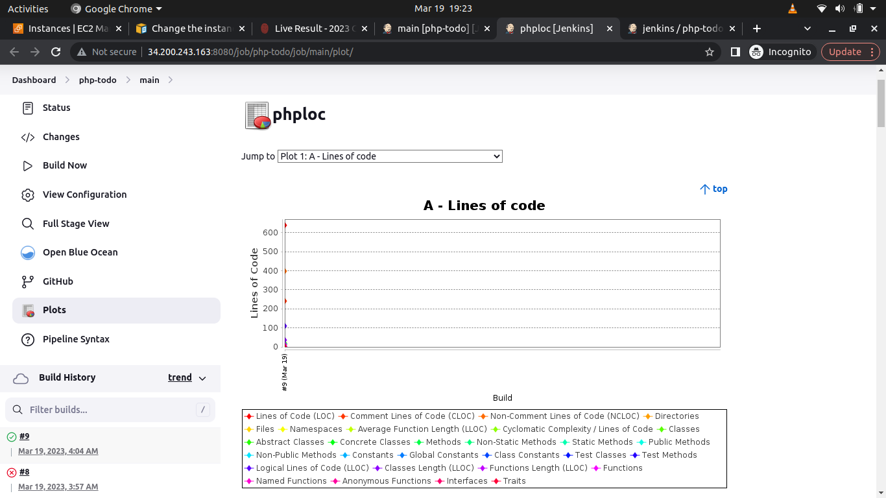

- Bundle the application code for into an artifact (archived package) upload to Artifactory

```
stage ('Package Artifact') {
    steps {
        sh 'zip -qr php-todo.zip ${WORKSPACE}/*'
    }
}
```
- Publish the resulted artifact into Artifactory

```
stage ('Upload Artifact to Artifactory') {
    steps {
        script { 
            def server = Artifactory.server 'artifactory-server'                 
            def uploadSpec = """{
            "files": [
                {
                    "pattern": "php-todo.zip",
                   "target": "PBL/php-todo",
                   "props": "type=zip;status=ready"

                }
            ]
            }""" 

            server.upload spec: uploadSpec
        }
    }
}
```

- Deploy the application to the dev environment by launching Ansible pipeline

```
stage ('Deploy to Dev Environment') {
    steps {
        build job: 'ansible-config-mgt/main', parameters: [[$class: 'StringParameterValue', name: 'env', value: 'dev']], propagate: false, wait: true
    }
}
```
Then push the code to the repository and trigger the build. You should now see a Plot menu item on the left menu. Click on it to see the charts. (The analytics may not mean much to you as it is meant to be read by developers. So, you need not worry much about it – this is just to give you an idea of the real-world implementation). result:

checkout static-assignments/deployment.yml to see further configuration for the artifact 

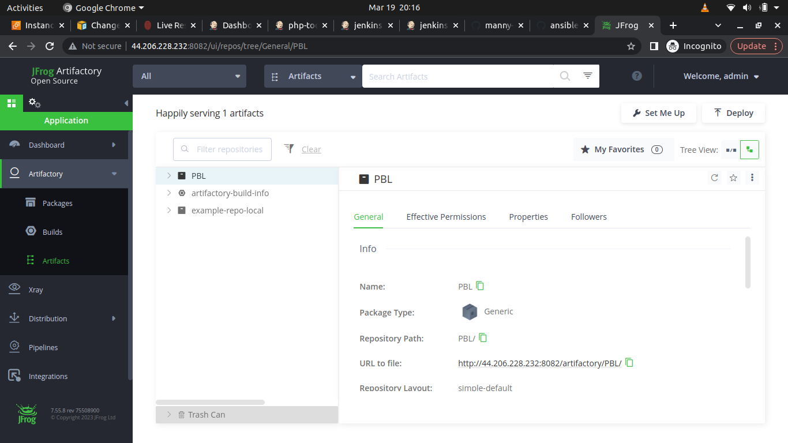


- To ensure that our deployment shows up on our server.
- Spin up a new EC2 instance
- Then configure our playbook to deploy the application to the new EC2 instance
- Then run the playbook to deploy the application to the new EC2 instance
- Then access the application on the new EC2 instance result:


Note: The build job used in this step tells Jenkins to start another job. In this case it is the ansible-project job, and we are targeting the main branch. Hence, we have ansible-project/main. Since the Ansible project requires parameters to be passed in, we have included this by specifying the parameters section. The name of the parameter is env and its value is dev. Meaning, deploy to the Development environment.

But how are we certain that the code being deployed has the quality that meets corporate and customer requirements? Even though we have implemented Unit Tests and Code Coverage Analysis with phpunit and phploc, we still need to implement Quality Gate to ensure that ONLY code with the required code coverage, and other quality standards make it through to the environments.

To achieve this, we need to configure SonarQube – An open-source platform developed by SonarSource for continuous inspection of code quality to perform automatic reviews with static analysis of code to detect bugs, code smells, and security vulnerabilities.

### SonarQube Installation

Before we start getting hands on with SonarQube configuration, it is incredibly important to understand a few concepts:

Software Quality – The degree to which a software component, system or process meets specified requirements based on user needs and expectations. Software Quality Gates – Quality gates are basically acceptance criteria which are usually presented as a set of predefined quality criteria that a software development project must meet in order to proceed from one stage of its lifecycle to the next one. SonarQube is a tool that can be used to create quality gates for software projects, and the ultimate goal is to be able to ship only quality software code.

Despite that DevOps CI/CD pipeline helps with fast software delivery, it is of the same importance to ensure the quality of such delivery. Hence, we will need SonarQube to set up Quality gates. In this project we will use predefined Quality Gates (also known as The Sonar Way). Software testers and developers would normally work with project leads and architects to create custom quality gates.

- Launch an ubuntu EC2 instance.

- The ansible role required to install SonarQube is available in the code repository/source code repo. To install SonarQube, we will need to run the jenkins pipeline against the ci environment. result:

- Now that sonarqube has been installed properly, ensure you have port 9000 open on the security group. Then navigate to the public IP address of the EC2 instance on port 9000. You should see the SonarQube login page.

```
http://<public-ip>:9000/sonar
```
Result:

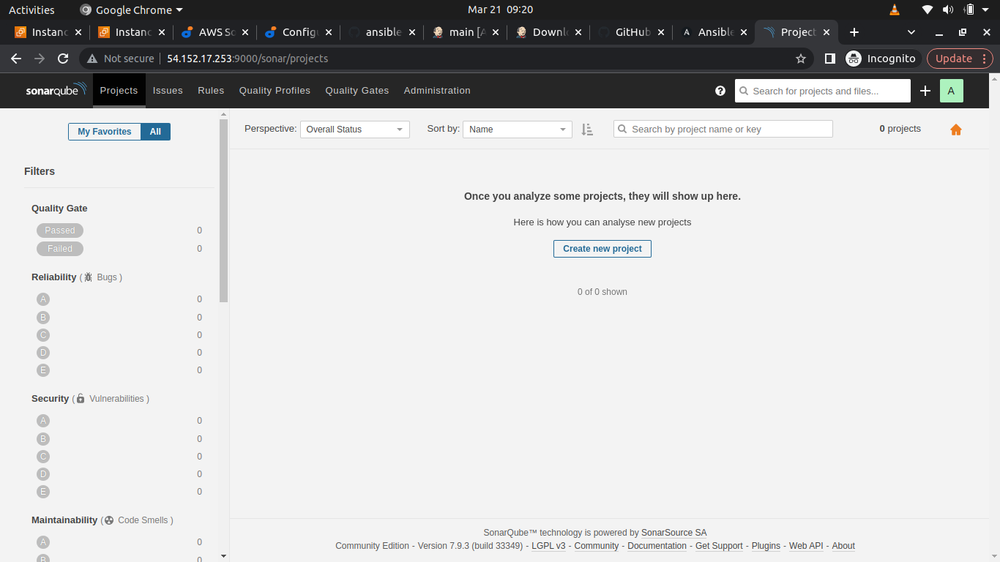

### CONFIGURE SONARQUBE AND JENKINS FOR QUALITY GATE

- In jenkins, install SonarQube Scanner plugin result:

- Navigate to Manage Jenkins > Configure System > SonarQube servers

- Add the url address of your sonarqube server

```
http://<public-ip>:9000/sonar
```
- Add the token generated by sonarqube (This is not necessary unless anonymous access is disabled) 

Result: 

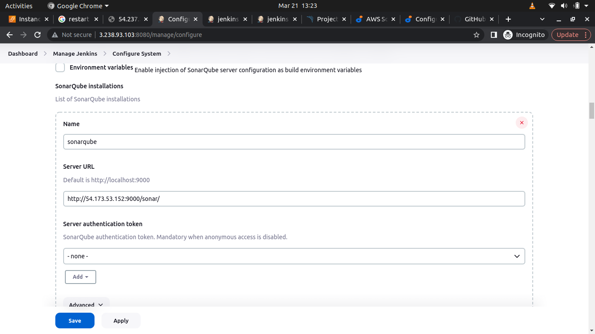

- Configure Quality Gate Jenkins Webhook in SonarQube – The URL should point to your Jenkins server http://{JENKINS_HOST}/sonarqube-webhook/ Navigate to Administration > Click on Configuration > Then on Webhooks > and then click on Create 

- Setup SonarQube scanner from Jenkins – Global Tool Configuration Navigate to Manage Jenkins > Global Tool Configuration > SonarQube Scanner
   - Once you're done click on apply and then save

- Let's proceed to update our Jenkinsfile to include the SonarQube scanner

```
    stage('SonarQube Quality Gate') {
        environment {
            scannerHome = tool 'SonarQubeScanner'
        }
        steps {
            withSonarQubeEnv('sonarqube') {
                sh "${scannerHome}/bin/sonar-scanner"
            }

        }
    }

```

and run the pipeline again 

Result:

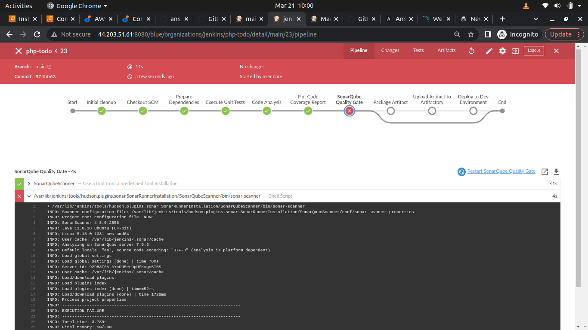

- Due to the error you go from running the pipeline. You need to Configure sonar-scanner.properties. You will need to go into the tools directory on the server to configure the properties file in which SonarQube will require to function during pipeline execution.
    - ssh into the jenkins server
    - cd /var/lib/jenkins/tools/hudson.plugins.sonar.SonarRunnerInstallation/SonarQubeScanner/conf/

```
cd /var/lib/jenkins/tools/hudson.plugins.sonar.SonarRunnerInstallation/SonarQubeScanner/conf/
```
- sudo nano sonar-scanner.properties
```
sudo nano sonar-scanner.properties
```
- Add the following configuration related to php-todo project

```
sonar.host.url=http://<SonarQube-Server-IP-address>:9000
sonar.projectKey=php-todo
#----- Default source code encoding
sonar.sourceEncoding=UTF-8
sonar.php.exclusions=**/vendor/**
sonar.php.coverage.reportPaths=build/logs/clover.xml
sonar.php.tests.reportPath=build/logs/junit.xml
```
- Save and exit

```
ctrl + x
```
Result:
[sonar-solved](sonar-resolved.png)

- The quality gate we just included has no effect. Why? Well, because if you go to the SonarQube UI, you will realise that we just pushed a poor-quality code onto the development environment.

Navigate to php-todo project in SonarQube

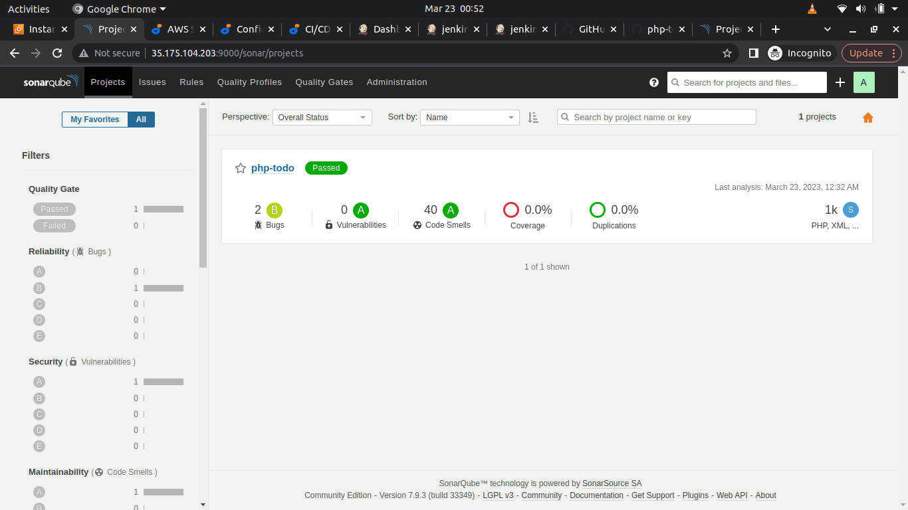

There are bugs, and there is 0.0% code coverage. (code coverage is a percentage of unit tests added by developers to test functions and objects in the code)

If you click on php-todo project for further analysis, you will see that there is 6 hours’ worth of technical debt, code smells and security issues in the code.

In the development environment, this is acceptable as developers will need to keep iterating over their code towards perfection. But as a DevOps engineer working on the pipeline, we must ensure that the quality gate step causes the pipeline to fail if the conditions for quality are not met.

### Conditionally deploy to higher environments

In the real world, developers will work on feature branch in a repository (e.g., GitHub or GitLab). There are other branches that will be used differently to control how software releases are done. You will see such branches as:

- Develop
- Master or Main (The * is a place holder for a version - - - - number, Jira Ticket name or some description. It can be something like Release-1.0.0)
- Feature/*
- Release/*
- Hotfix/

There is a very wide discussion around release strategy, and git branching strategies which in recent years are considered under what is known as GitFlow. Assuming a basic gitflow implementation restricts only the develop branch to deploy code to Integration environment like sit.

- Let us update our Jenkinsfile to implement this:
  - First, we will include a When condition to run Quality Gate whenever the running branch is either develop, hotfix, release, main, or master
  - Then we add a timeout step to wait for SonarQube to complete analysis and successfully finish the pipeline only when code quality is acceptable.

```
  stage('SonarQube Quality Gate') {
      when { branch pattern: "^develop*|^hotfix*|^release*|^main*", comparator: "REGEXP"}
        environment {
            scannerHome = tool 'SonarQubeScanner'
        }
        steps {
            withSonarQubeEnv('sonarqube') {
                sh "${scannerHome}/bin/sonar-scanner -Dproject.settings=sonar-project.properties"
            }
            timeout(time: 1, unit: 'MINUTES') {
                waitForQualityGate abortPipeline: true
            }
        }
    }

```

To test, create different branches and push to GitHub. You will realise that only branches other than develop, hotfix, release, main, or master will be able to deploy the code.

If everything goes well, you should be able to see something like this:

Note: You might encounter the error below here's how to fix it:

```
sudo apt install npm
php --ini | grep xdebug

```
edit the configuration file and add the line

```
sudo nano /etc/php/7.4/cli/conf.d/20-xdebug.ini
```
```
xdebug.mode=coverage
```
then restart php-fpm

```
sudo systemctl restart php7.4-fpm
```

and rerun the pipeline and you should get this

- Now open sonarqube and you should see the results

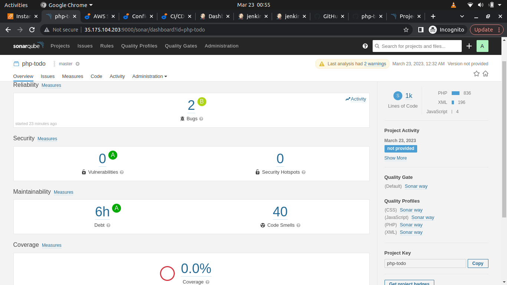

- Introduce Jenkins agents/slaves – Add 2 more servers to be used as Jenkins slave. Configure Jenkins to run its pipeline jobs randomly on any available slave nodes.

- Spin up 2 more servers
- Install Java on the servers
- Then open the .bash_profile file and add the following lines

```
export JAVA_HOME=$(dirname $(dirname $(readlink $(readlink $(which javac)))))
export PATH=$PATH:$JAVA_HOME/bin
export CLASSPATH=.:$JAVA_HOME/jre/lib:$JAVA_HOME/lib:$JAVA_HOME/lib/tools.jar

```
- Then source the file

```
source ~/.bash_profile
```
- Then go to the jenkins dashboard > Manage Jenkins > Manage Nodes and Clouds > New Node

- Add the following details:

- Remote root directory: /home/ubuntu/
Then save

- When the agents are connected you should see this in the dashboard

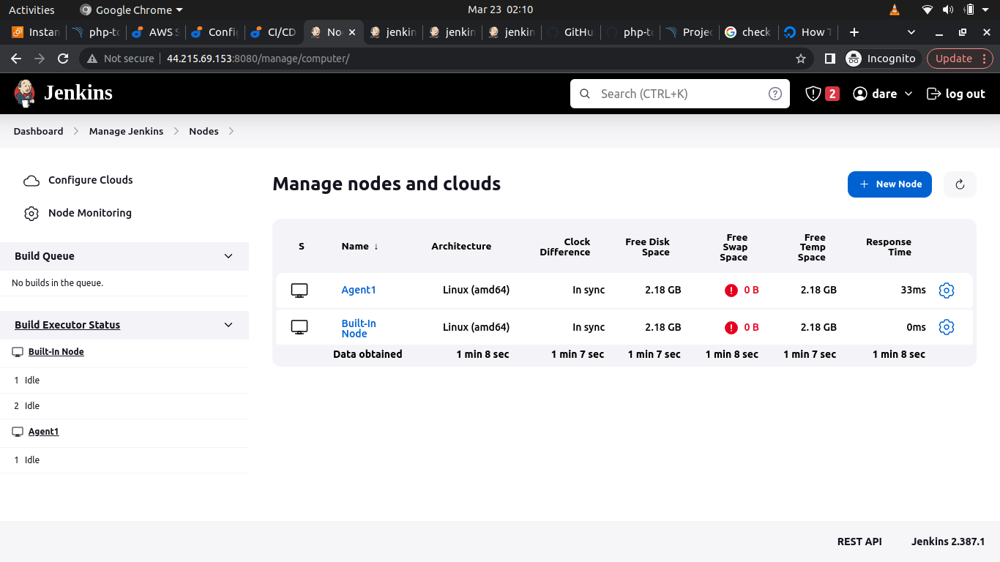

Note: the goal of jenkins slave is to shed load from the jenkins server to the slave servers

- Now we need to configure webhooks for our repositories in Github to ensure that it monitors the repository for any changes and triggers the pipeline to run automatically.

- Go to the repository in Github and click on settings

- Then click on webhooks

- Then add the url of the jenkins server

### Github webhooks

```
http://<Jenkins-Server-IP-address>:8080/github-webhook/
```
